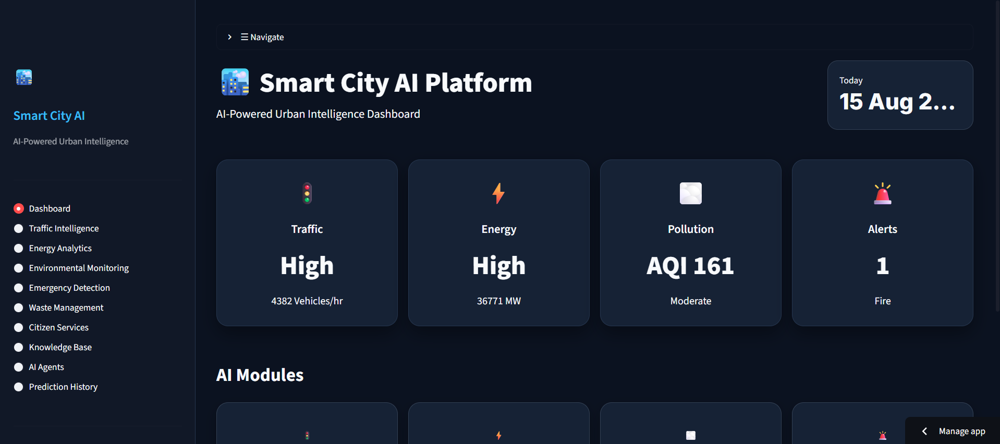
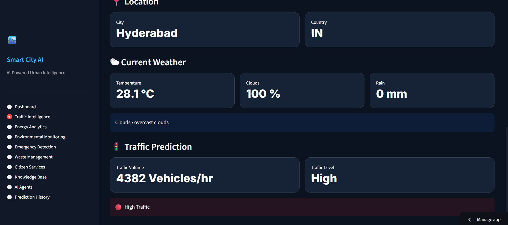
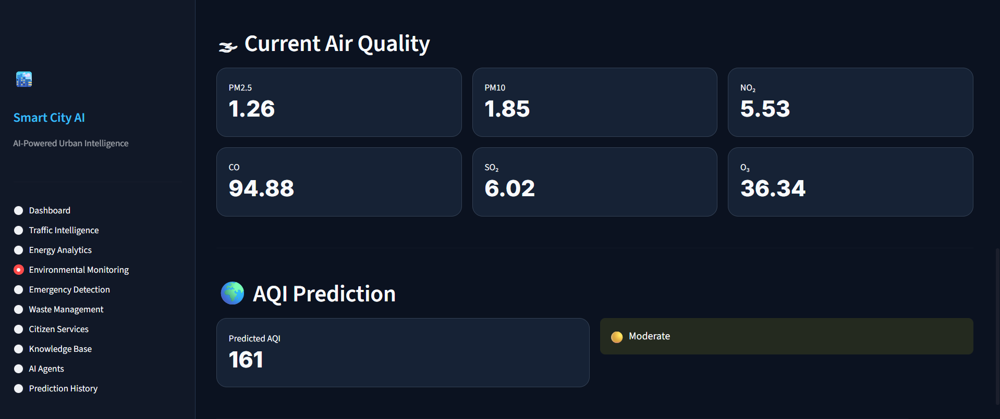
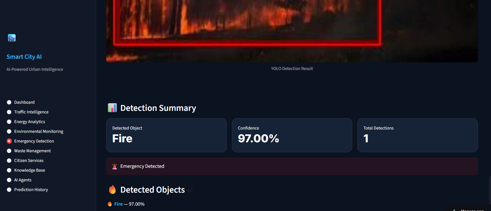
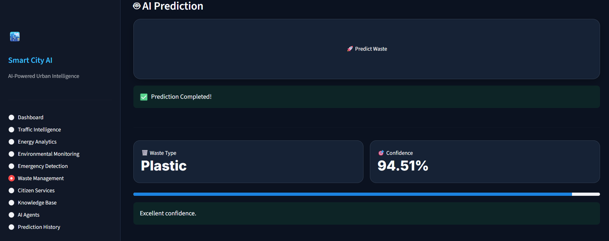
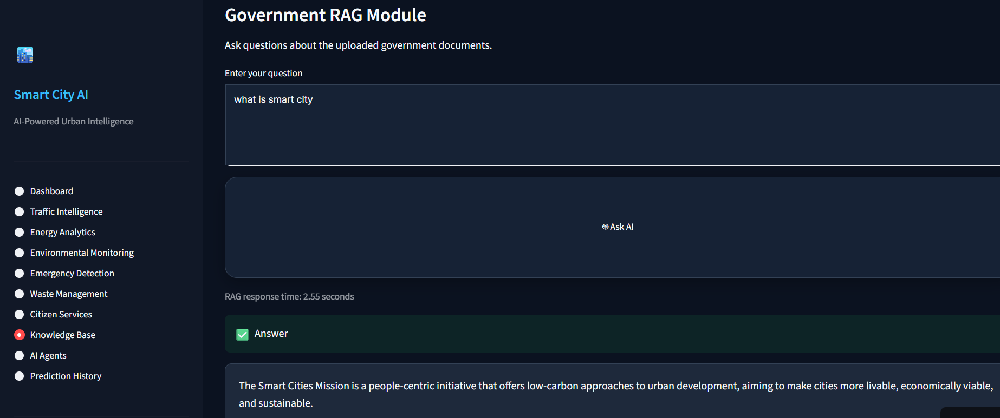
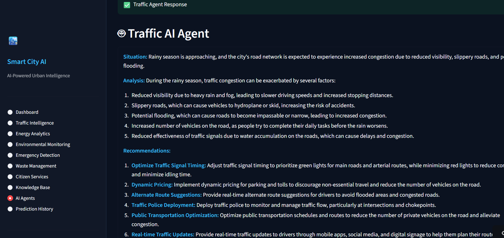

<<<<<<< HEAD
# 🏙️ Smart City AI Platform

> An AI-powered urban intelligence platform combining Machine Learning, Computer Vision, NLP, Retrieval-Augmented Generation (RAG), and AI Agents to support smarter city operations.

[](https://smart-city-intelligence-platform.streamlit.app/)
[](https://smart-city-ai-1la1.onrender.com/)
[](https://www.python.org/)

## 🚀 Live Demo

**Application:** https://smart-city-intelligence-platform.streamlit.app/

**Backend API:** https://smart-city-ai-1la1.onrender.com/

**API Documentation:** https://smart-city-ai-1la1.onrender.com/docs

---

## 📌 Project Overview

The **Smart City AI Platform** is a full-stack AI application designed to bring multiple urban intelligence capabilities into a single platform.

It combines predictive Machine Learning models, Computer Vision, NLP, RAG, AI Agents, and a prediction-history database behind a Streamlit interface and FastAPI backend.

The platform is designed around practical smart-city use cases such as:

- Traffic intelligence
- Energy analytics
- Environmental monitoring
- Emergency detection
- Waste management
- Citizen services
- Government-document question answering
- AI-assisted urban decision support

---

## ✨ Key Features

### 🚦 Traffic Intelligence
Predict traffic volume and classify traffic conditions using a trained Machine Learning model.

### ⚡ Energy Analytics
Predict and analyze power consumption for urban energy-management scenarios.

### 🌫️ Environmental Monitoring
Support pollution/AQI analysis and environmental intelligence.

### 🚨 Emergency Detection
Use Computer Vision to support emergency-event detection workflows.

### ♻️ Waste Management
Classify waste using a trained deep-learning Computer Vision model.

### 👤 Citizen Services
Provide AI-assisted interaction for citizen-oriented services.

### 📚 Knowledge Base
Use RAG to answer questions from uploaded government/smart-city documents.

The production RAG pipeline uses a preprocessed document cache and lightweight keyword retrieval before sending relevant context to the Groq LLM.

### 🤖 AI Agents
Provide specialized AI-agent interfaces for:

- Traffic
- Energy
- Waste
- Emergency

### 📜 Prediction History
Store and display prediction results through the Smart City database.

### 📱 Responsive Navigation
The application includes mobile-friendly navigation so users can move between modules after completing predictions.

---

## 🧠 Machine Learning

The platform combines multiple AI approaches:

| AI Area | Use Case |
|---|---|
| Regression | Traffic prediction |
| Regression | Power consumption prediction |
| Environmental prediction | Pollution/AQI intelligence |
| Classification | Waste classification |
| Computer Vision | Emergency detection |
| NLP | Citizen services |
| RAG | Government-document question answering |
| AI Agents | Urban decision support |

### Traffic Prediction Model

The Traffic Intelligence module uses a trained Random Forest model.

Reported evaluation results:

| Metric | Result |
|---|---:|
| MAE | 215.37 |
| RMSE | 378.28 |
| R² Score | 0.9642 |

The trained traffic model is served through the FastAPI backend.

---

## 📚 RAG Knowledge Base

The Knowledge Base module implements a lightweight production-oriented RAG workflow.

### Pipeline

```text
Government PDF
      ↓
PDF preprocessing
      ↓
Document chunks
      ↓
Preprocessed JSON cache
      ↓
Keyword-based retrieval
      ↓
Top relevant chunks
      ↓
Groq LLM
      ↓
Answer
```

The production deployment uses a preprocessed cache containing **281 document chunks** from the Smart City government document.

This avoids repeatedly parsing the full PDF during every request and significantly improves deployment reliability.

---

## 🤖 AI Agent Architecture

The AI Agents module provides specialized agents for different urban domains.

```text
User Question
      ↓
Streamlit AI Agent Interface
      ↓
FastAPI /agents/chat
      ↓
Selected Specialized Agent
      ↓
AI Response
```

Available agents:

- 🚦 Traffic Agent
- ⚡ Energy Agent
- ♻️ Waste Agent
- 🚨 Emergency Agent

---

## 🏗️ System Architecture

```text
                         ┌─────────────────────┐
                         │       User          │
                         └──────────┬──────────┘
                                    │
                                    ▼
                         ┌─────────────────────┐
                         │     Streamlit       │
                         │      Frontend       │
                         └──────────┬──────────┘
                                    │
                           HTTP / REST API
                                    │
                                    ▼
                         ┌─────────────────────┐
                         │       FastAPI       │
                         │       Backend       │
                         └──────────┬──────────┘
                                    │
          ┌─────────────────────────┼─────────────────────────┐
          │                         │                         │
          ▼                         ▼                         ▼
   ┌──────────────┐        ┌────────────────┐        ┌───────────────┐
   │  ML Models   │        │   RAG System   │        │  AI Agents    │
   │ Regression / │        │ PDF → Chunks → │        │ Traffic       │
   │ Classification│       │ Retrieval → LLM│        │ Energy        │
   │ Computer Vision│      └────────────────┘        │ Waste         │
   └──────────────┘                                  │ Emergency     │
                                                     └───────────────┘
          │                         │                         │
          └─────────────────────────┼─────────────────────────┘
                                    ▼
                           ┌─────────────────┐
                           │ SQLite / History│
                           └─────────────────┘
```

---

## 🛠️ Technology Stack

### Frontend
- Python
- Streamlit
- Pandas
- Plotly
- Requests

### Backend
- FastAPI
- Uvicorn
- Pydantic
- SQLAlchemy
- SQLite

### Machine Learning
- NumPy
- Pandas
- Scikit-learn
- SciPy
- Joblib

### Computer Vision / Deep Learning
- PyTorch
- TorchVision
- TensorFlow
- Keras
- Ultralytics
- ONNX
- ONNX Runtime
- OpenCV
- Pillow

### NLP / Generative AI
- Groq
- Groq Model: openai/gpt-oss-20b
- LangChain
- LangChain-Groq
- Hugging Face
- Sentence Transformers
- NLTK
- TextBlob

### RAG / Document Processing
- PyPDF
- FAISS
- ChromaDB
- LangChain document loaders
- Preprocessed JSON document cache

### Deployment
- GitHub
- Render
- Streamlit Cloud

---

## 🔌 API Endpoints

The FastAPI backend exposes module-specific REST endpoints.

The complete interactive API documentation is available through Swagger:

**https://smart-city-ai-1la1.onrender.com/docs**

Key backend areas include:

| Module | API Area |
|---|---|
| Traffic | Traffic prediction |
| Energy | Energy prediction |
| Pollution | Pollution prediction |
| Emergency | Emergency detection |
| Waste | Waste classification |
| Citizen AI | Citizen-service AI |
| RAG | `/rag/ask` |
| AI Agents | `/agents/chat` |
| History | `/history/` |

---

## 📁 Project Structure

```text
Smart-City-AI/
│
├── backend/
│   └── app/
│       ├── routers/
│       ├── schemas/
│       ├── services/
│       ├── ml_models/
│       ├── rag/
│       │   ├── documents/
│       │   └── rag_chunks.json
│       ├── static/
│       └── main.py
│
├── frontend/
│   ├── app.py
│   ├── config.py
│   ├── components/
│   │   ├── cards.py
│   │   ├── charts.py
│   │   ├── history_card.py
│   │   ├── sidebar.py
│   │   └── styles.py
│   ├── views/
│   │   ├── dashboard.py
│   │   ├── traffic.py
│   │   ├── energy.py
│   │   ├── pollution.py
│   │   ├── emergency.py
│   │   ├── waste.py
│   │   ├── citizen_ai.py
│   │   ├── rag.py
│   │   ├── agents.py
│   │   └── history.py
│   └── requirements.txt
│
├── prepare_rag.py
├── backend requirements.txt
└── README.md
```

---

## ⚙️ Environment Variables

API keys are kept outside the source code.

Example local `.env` configuration:

```env
GROQ_API_KEY=your_groq_api_key
OPENWEATHER_API_KEY=your_openweather_api_key
```

For the deployed applications, environment/secrets settings are configured separately in the hosting platforms.

**Never commit real API keys or `.env` secrets to GitHub.**

---

## 💻 Run Locally

### 1. Clone the repository

```bash
git clone https://github.com/sire-esha372/Smart-City-AI.git
cd Smart-City-AI
```

### 2. Create and activate a virtual environment

Windows:

```powershell
python -m venv .venv311
.venv311\Scripts\activate
```

### 3. Install backend dependencies

```powershell
pip install -r backend/requirements.txt
```

### 4. Configure environment variables

Create a `.env` file with the required API keys.

### 5. Start FastAPI

From the project root:

```powershell
cd backend
uvicorn app.main:app --reload
```

### 6. Start Streamlit

Open another terminal:

```powershell
streamlit run frontend/app.py
```

The frontend will connect to the local backend using:

```text
http://127.0.0.1:8000
```

---

## ☁️ Deployment

### Backend

The FastAPI backend is deployed on **Render**.

Production backend:

```text
https://smart-city-ai-1la1.onrender.com
```

### Frontend

The Streamlit application is deployed on **Streamlit Cloud**.

Production frontend:

```text
https://smart-city-intelligence-platform.streamlit.app/
```

The frontend uses an environment-based backend URL so local development and production deployment can use different backend endpoints without changing application logic.
----------


## 📸 Application Screenshots

### 🏙️ Dashboard



---

### 🚦 Traffic Intelligence



---

### 🌫️ Environmental Monitoring



---

### 🚨 Emergency Detection



---

### ♻️ Waste Classification



---

### 📚 RAG Knowledge Base



---

### 🤖 AI Agents



### Dashboard

The main dashboard provides an overview of traffic, energy, pollution, alerts, and available AI modules.


### AI Modules

The platform brings the major smart-city AI capabilities into one interface.


### Traffic Prediction

The Traffic Intelligence module provides a predicted traffic volume and traffic-level classification.


### Mobile Navigation

The application includes mobile-friendly navigation for moving between prediction and AI modules.


> Add the corresponding screenshots to a `screenshots/` folder in the repository using the filenames shown above.

---

## 🔐 Security

- API keys are stored through environment variables.
- `.env` is excluded from version control.
- Production secrets are configured through hosting-platform environment settings.
- Sensitive credentials are not included in the repository.

---

## 🎯 Project Highlights

This project demonstrates practical implementation across the full AI application lifecycle:

```text
Data
 ↓
EDA / Preprocessing
 ↓
Machine Learning
 ↓
Model Saving
 ↓
FastAPI APIs
 ↓
Streamlit Frontend
 ↓
RAG / Generative AI
 ↓
AI Agents
 ↓
Database / Prediction History
 ↓
Cloud Deployment
```

It also demonstrates the ability to troubleshoot production issues, including optimizing the RAG pipeline for a constrained cloud deployment environment.

---

## 🔮 Future Enhancements

Potential future improvements include:

- Real-time traffic data integration
- Live city-map visualization
- More advanced semantic/vector retrieval for RAG
- Role-based dashboards
- Real-time emergency alerts
- Additional specialized AI agents
- Automated model monitoring
- Advanced analytics and reporting

---

## 👩‍💻 Author

**Sireesha Pinnamaraju**

B.Tech Graduate | AI/ML & Data Science

GitHub: https://github.com/sire-esha372/Smart-City-AI

---

## ⭐ If You Find This Project Useful

Consider starring the repository and exploring the live demo.

**Live Demo:** https://smart-city-intelligence-platform.streamlit.app/

**API Docs:** https://smart-city-ai-1la1.onrender.com/docs
=======
